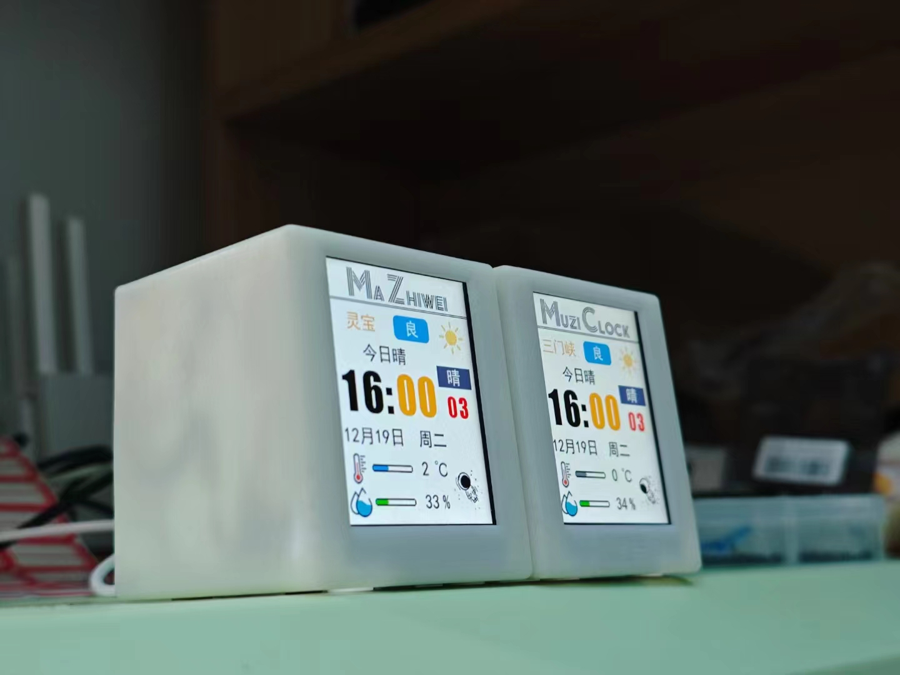

# muziclock

一个桌面小摆件，可以查看时间和天气还有可爱的太空人，可切换黑白主题，可以推送本机的cpu 内存和网络的占用给这个小摆件进行显示，全部代码开源

原作者的b站链接:[手把手复刻2.4寸Dudu天气时钟 第一期 项目介绍_哔哩哔哩_bilibili](https://www.bilibili.com/video/BV1SQ4y1b7CL/?spm_id_from=333.788&vd_source=1b728808f639a0b927883f005107847a)

## 修改的地方

- 1、原作者不支持显示cpu内存网络占用等信息，我在最后一个页面添加了此项，同时需要驱动实现将电脑的实时信息推送至时钟，同时可以在驱动中修改当前显示天气的地点，和切换主题，更改wifi信息

- 2、原作者显示天气页面不太好，我进行了微调

- 3、配网页面的二维码显示，我进行了调整

- 。。还有一些小地方的修改
  
  > 同时非常感谢原作者的辛勤付出,本项目也同样开源,并遵循原作者意见

展示图如下，可以定义标题  比如送给朋友

